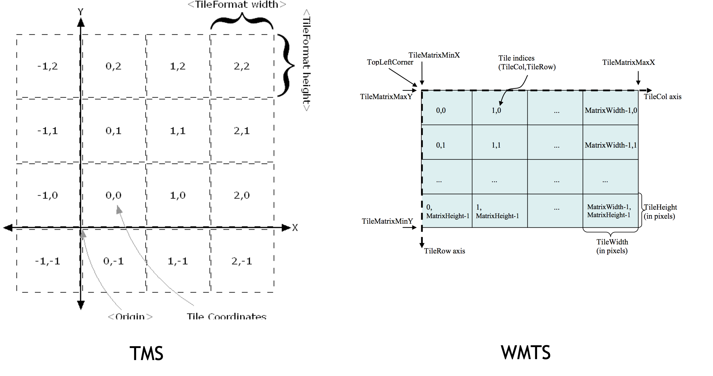

# Create / distrubute tiled map

Taro Matsuzawa
Georepublic Japan

---

# Notes (1/2)

- This presentation use some links to external resources
  - Please download the presentation from the link below

https://github.com/smellman/jica_2023

---

# Notes (2/2)

- This presentation is written in Markdown
  - You can edit this presentation with any text editor
  - You can convert this presentation to PDF or PowerPoint, please see the README.md
  - You can download the presentation of auto generate versions from the link below
    - [PDF](https://smellman.github.io/jica_2023/jica-seminar-2023.pdf)
    - [PowerPoint](https://smellman.github.io/jica_2023/jica-seminar-2023.pptx)
    - [HTML](https://smellman.github.io/jica_2023/)
---

# Self introduction

- GIS Engineer at Georepublic Japan
  - Programming: Python, JavaScript, TypeScript, Ruby etc.
  - UNIX and Linux guru
  - GIS skill: Data processing, Tiled based Map
- Community
  - Director of [OSGeo.JP](https://www.osgeo.jp/)
  - Director of [OpenStreetMap Foundation Japan](https://www.osmf.jp/)
  - Sub president of [Japan Unix Society](https://www.jus.or.jp/)
  - [UNOpenGIS/7](https://github.com/UNopenGIS/7) volunteer
- Contact: taro@georepublic.co.jp / @smellman on Twitter

---

# Today's agenda

- What is tiled map?
- Introduction of software and data in this presentationå
- How to create your own tiled map
- How to design your own tiled map
- How to distribute your own tiled map

---

# What is tiled map?

---

# Tile technology

- Provide map image or data over the internet.
  - Map images are separated as tiles.
  - Zoom Level 0 = World
  - Each zoom level doubles in the dimensions.
  - Too many tiles use "Web Mercator" projection.

https://a.tile.openstreetmap.org/0/0/0.png

---

# Useful to web

- Structure of tile is useful for web.
  - Enable to scroll map smoothly.
  - Enable to zoom up and zoom down map smoothly.
  - HTTP GET request.
- Tile become known for Google Maps.
  - Tile has existed from the late 1990s.

---

# Zoom

- Zoom level 0 : 1 file
- Zoom level 1 : 2 x 2 = 4 files
- Zoom level 2 : 4 x 4 = 16 files
- ...
- Zoom level 18 : 2^18 x 2^18 = 262,144 x 262,144 = 68,719,476,736 files

https://maps.gsi.go.jp/help/image/tileNum.png

---

# GET Request

- Many services use REST API(GET Request).
  - https://.../Z/X/Y.Format
  - Z: Zoom Level
  - X: X coordinate
  - Y: Y coordinate
  - Format: 
    - Raster image format(png, jpg, webp)
    - Vector data format(pbf, mvt)

---

# GET Request example

- https://a.tile.openstreetmap.org/3/2/4.png
  - Zoom = 3, X = 2, Y = 4, format = png
  - X and Y coordinates start with 0.

---

# Specification

- Two tile service specifications are popular.
  - Tile Map Service(TMS)
  - Web Map Tile Service(WMTS)
- TMS is simpler than WMTS.
- TMS's X Y coordinate is started from bottom left.
  - Same as Cartesian coordinate system.
- WMTS's X Y coordinate is started from top left.
  - Same as Coordinate system of 2D computer graphics.

---

---

# The Y coordinate flipped

- OpenStreetMap use TMS like protocol but Y coordinate is numbered from top.
  - OpenStreetMap call "Slippy Map".
  - We call xyz tile.
    - {z}/{x}/{y}.png
    - Also we call zxy tile.

https://maps.gsi.go.jp/help/image/tileNum.png

---